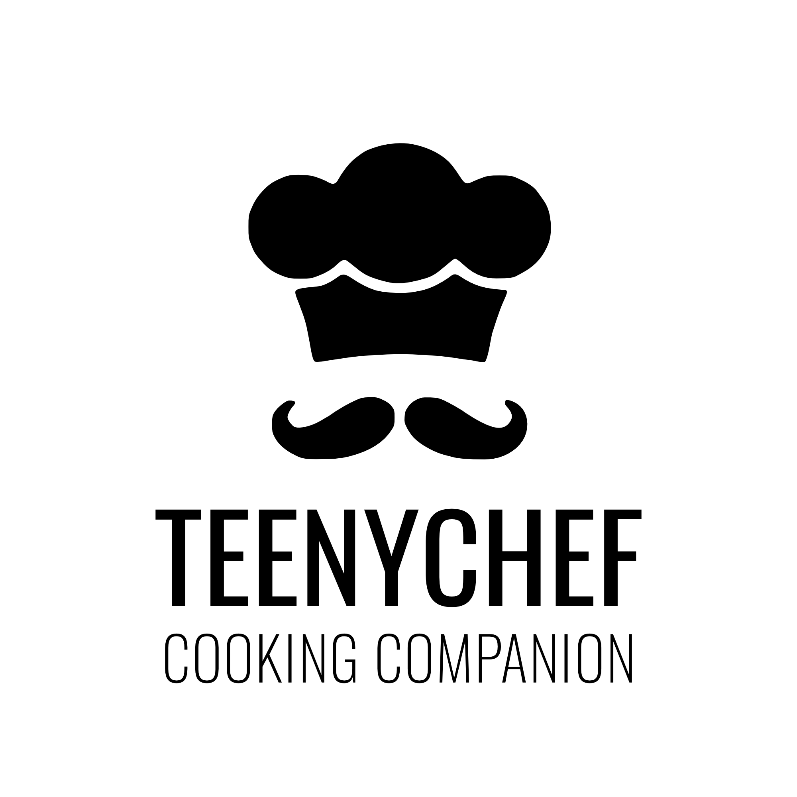

  

 

TeenyChef is a self-hosted kitchen helper built with React and Python which allows you to keep track of your daily cooking and help with dinner choices.

## Why did we create TeenyChef?

We built TeenyChef to fill a void in our self-hosted ecosystem, a simple, and integrated, kitchen management solution. There are plenty of applications which strive to reach our goals (or part of them).

However, we wish to develop a polished, modern, and effective open source solution.

## What can TeenyChef do?

<i>TeenyChef is currently pre-release and is undergoing initial development</i>

TeenyChef is a growing project which has a large road-map of goals, some of our current features are shown below!

- Add your own recipes
- Scrape recipes from a third party
- Adjust recipes based upon serving size
- Query from a database of ingredients to show serving nutritional information (requires API key)
- Track your kitchen stocks, and automatically suggest recipes you can make

## Technology Stack

### Front-end

- React
- TailwindCSS
- Bulma

### Back-end

- [FastAPI](https://github.com/tiangolo/fastapi)
- [MkDocs](https://www.mkdocs.org/)
- [Material for MkDocs](https://squidfunk.github.io/mkdocs-material/)
- [Flask-SQLAlchemy](https://flask-sqlalchemy.palletsprojects.com/en/2.x/)
